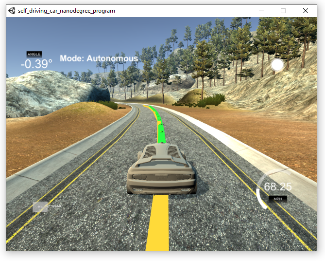
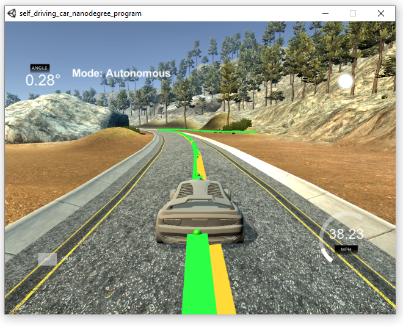

# Self Driving Car Engineer Project 10 - Model Predictive Control
## Benjamin Söllner, 11 Oct 2017

---


---

This C++ project of the Udacity Self Driving Car Engineer Nanodegree implements
a Predictive Controller to steer a vehicle on a given track.
The track information as well as the control information (throttle + steering)
are exchanged via a websocket interface with the Udacity Self Driving Car
Simulator. The corresponding project page can be found
[here](https://classroom.udacity.com/nanodegrees/nd013/parts/40f38239-66b6-46ec-ae68-03afd8a601c8/modules/f1820894-8322-4bb3-81aa-b26b3c6dcbaf/lessons/b1ff3be0-c904-438e-aad3-2b5379f0e0c3/concepts/1a2255a0-e23c-44cf-8d41-39b8a3c8264a).

The predictive controller calculates a polynomial through the waypoints that
are closest to the vehicle and then carculates cross-track-error and bearing
error for the current vehicle position as well as for any vehicle position
that is on the predicted trajectory of the vehicle given a set of actuator
inputs along the next ``N`` timesteps of duration ``dt``.

The predictive controller then aims to minimize the cross-track-error, the
bearing error as well as the magnitude of the steering inputs across all
timesteps ``N``.



## Reflection

### The Model - State, Actuators and Update Equations

The actuators are represented as *delta* (steering) and *a* (throttle). The
vehicle state at any predicted time is represented as follows:

* ``x`` ... the x-position
current time
* ``y`` ... the y-position
* ``psi`` ... the bearing
* ``v`` ... the velocity along the x axis
* ``cte`` ... the cross-track-error orthogonal to the polygon drawn by
the waypoints
* ``epsi`` ... the bearing error in relation to the tangent applied to the
polygon of waypoints.

All coordinates are in relation to the vehicle coordinate system at the
current time.

The actuators for the motion model are:

* ``delta`` ... the steering
* ``a`` ... the throttle

From the current vehicle state at timestep ``t0``, the state at the next timestep
``t1`` (with ``t1-t0=dt``) can be calculated as follows:

```
x[t1] = x[t0] + v[t0] * cos(psi[t0]) * dt
y[t1] = y[t0] + v[t0] * sin(psi[t]) * dt
psi[t1] = psi[t0] + v[t0] / Lf * delta[t] * dt
v[t1] = v[t0] + a[t0] * dt
cte[t1] = f(x[t0]) - y[t0] + v[t0] * sin(epsi[t]) * dt
// ... with f(x)=ax^3+bx^2+c being the polygon representing the waypoint path
epsi[t1] = psi[t0] - psides[t0] + v[t0] * delta[t0] / Lf * dt
// ... with psides[t0] being the "designated bearing" at point t0, calculated
//     by atan(c) with c from f(x)=ax^3+bx^2+c.
```

The vehicle and motion model is then applied in an *ipopt*-Solver.

* For the motion model, each constraint ``g(t1)=h(t0)`` is applied as a
constraint ``g(t1)-h(t0)`` that is optimized towards zero (upper and lower
bound) thereby pushing the vehicle to it's optimal state on its predicted
trajectory
* For the vehicle model (inital state), each state ``g(t1)=s`` is applied as
a constraint ``g(t1)`` that is optimized towards ``s`` (upper and lower bound)
thereby asserting that the optimization indeed accounts for the vehicle starting
at the state it is currently at
* For the actuators, meaningful upper and lower bounds are chosen (-0.436 ..
0.436 for ``delta``, -1.0 .. 1.0 for ``a``) so that the actuators stay within
physical possible limits
* The cost is not limited by upper and lower limits.

However, the cost is still mimized by the optimizer, and the following values
are summed up into the cost:

* all squared ``cte``s across all ``N`` points, with an additional
``cte_penalty`` factor of 5 each
* all squared ``epsi``s across all ``N`` points
* all squared differences to the reference velocity (``v-v_ref``) across all
``N`` points
* all steering inputs ``delta`` across all ``N`` points with an additional
``steering_penalty`` factor of 2000 each
* all throttle inputs ``a`` across all ``N`` points
* all squared differences of steering inputs ``delta[t1]-delta[t0]`` between
subsequent steering actuations (``N-1`` data points)
* all squared differences of steering inputs ``a[t1]-a[t0]`` between
subsequent throttle actuations (``N-1`` data points)

By constraining the *ipopt* optimizer like described above, and furthermore
minimizing the cost, the right set of actuations and resulting trajectory can
be found at each timestep.

### Various Tests of Timestep Length and Elapsed Duration (``N`` & ``dt``)

``N`` is the amount of steps predicted by the predictive controller and ``dt``
is the time distance between those steps. Various values for ``N`` and ``dt``
have been explored. ``N`` stayed in the ballpark of 10-30 and ``dt`` in the
ballpark of ``some_factor * anticipated_latency``. ``N=15`` and ``dt=0.15``
was found to be working quite good.

#### ``dt`` too low (``N=15, dt=0.05``)

If ``dt`` is too low, the car drifts
off the controlled trajectory, similarly than a too low D-coefficienct in a PID
controller. This can eventually lead to fatal behaviour.


#### ``N`` too high, ``dt`` too low (``N=25, dt=25``)

The previous behaviour can be somewhat counteracted by increasing ``N``.
However, increasing ``N`` increases computation time and thereby latency,
ultimately leading to sluggish and unprecise control behaviour. Notice how in
the screenshot below, the car only actuates after the first part of the
predicted trajectory has already passed.


#### ``dt`` too high (``N=20, dt=0.05``)

If ``dt`` is too high, especially in a case where it involves a predicted
trajectory with too many curves, the optimization becomes unstable and the
predicted path sort-of wiggely:



This can lead to the car oversteering and ultimately leaving the track:


### Polynomial Fitting and MPC Preprocessing

Polynomial fitting was accomplished by transforming the waypoint coordinates into
the vehicle coordinate system (see ``main.cpp``):

```c++
// Convert waypoints from global to car coordinate system
// Eigen::VectorXd representation needed for MPC
Eigen::VectorXd wayptsx_car(wayptsx.size());
Eigen::VectorXd wayptsy_car(wayptsy.size());
// vector<double> representation needed for output of polynom to simulator (later)
vector<double> wayptsx_car_v(wayptsx.size());
vector<double> wayptsy_car_v(wayptsx.size());
for (unsigned int i = 0; i < wayptsx.size(); i++) {
    double x = (wayptsx[i]-px) * cos(psi) + (wayptsy[i]-py) * sin(psi);
    double y = -(wayptsx[i]-px) * sin(psi) + (wayptsy[i]-py) * cos(psi);
    wayptsx_car[i] = x;
    wayptsx_car_v[i] = x;
    wayptsy_car[i] = y;
    wayptsy_car_v[i] = y;
}
```

... and then using the ``polyfit(...)`` function to fit a polynomial. The
polynomial was used in the predictive controller to calculate the errors ``cte``
and ``epsi``.

```c++
// Fit polynomial through waypoints
const int poly_order = 2;
Eigen::VectorXd coeff = polyfit(wayptsx_car, wayptsy_car, poly_order);

// Prepare state vector, for cte and epsi use polynome
// we just created
Eigen::VectorXd state(6);
// x,y - car is at center of its own coordinate system in
//       initial state
state[0] = 0.0;
state[1] = 0.0;
// psi - car points straight forward
state[2] = 0.0;
// v - speed, m/s
state[3] = v;
// cte - is simply f(0.0)
state[4] = polyeval(coeff, 0.0);
// epsi - angle btw. f(x) & x-axis at x=0 --> arctan(f'(0))
//        f=ax^3+bx^2+cx+d --> f'(x)=3ax^2+2bx+c --> f'(0)=c
state[5] = -atan(coeff[1]);
```

Various other steps have been applied as preprocessing step:

* Accounting for latency: see next section
* Calculating reference velocity: depending on whether the current section
of the road (i.e. the current fitted polynomial) was curved or straight the
reference velocity was set to "high" or "low". Also, if the car "just started"
(i.e., the current velocity was very low), the reference velocity is set higher
in order to speed up faster.

```c++
// calculate radius of curvature of polynomial f(x) at x=0
double radius;
// catch division by zero
if (fabs(coeff[2]) > 0.0001) {
    // R(x) = ((1 + (dy/dx)^2)^1.5) / abs(d^2y/dx^2)
    //      = ((1 + f'(x)^2)^1.5) / abs(f''(x))
    //      = ((1 + (3ax^2+2bx+c)^2)^1.5 / abs(6ax+2b)
    // R(0) = ((1 + c^2)^1.5 / abs(2b)
    radius = pow(1.0+pow(coeff[1], 2), 1.5) / fabs(2.*coeff[2]);
} else {
    radius = 1000.;
}

// Set reference speed depending on radius
double v_ref; // in mph. MPC will convert to m/s2
if (v_mph < 60.) {
    // at beginning, speed up
    v_ref = 120;
} else {
    if (radius < 80) {
        // in a turn, slow down
        v_ref = 60;
    } else {
        // in a straight road, accelerate!
        v_ref = 90;
    }
}
v_ref *= mph_to_mps;
```

### Accounting for Latency

The latency was assumed to be slightly higher than the artificial latency
of 0.1ms. Therefore, we assume the initial state of the car to be ~0.12ms
ahead of its current state. We simply update the state according to our
motion model. This does not take into consideration that bearing and velocity
might change over the 0.12ms, but should be a fair approximation (see
``main.cpp``):

```c++
// Take into account latency (assumes psi and v constant)
const double latency = 0.12 ; // ~120 ms
if (latency > 0) {
    px = px + v * cos(psi) * latency;
    py = py + v * sin(psi) * latency;
    psi = psi - v * deg2rad(prev_steer_value * 25.) / mpc.Lf * latency;
}
```


## Dependencies

* cmake >= 3.5
 * All OSes: [click here for installation instructions](https://cmake.org/install/)
* make >= 4.1(mac, linux), 3.81(Windows)
  * Linux: make is installed by default on most Linux distros
  * Mac: [install Xcode command line tools to get make](https://developer.apple.com/xcode/features/)
  * Windows: [Click here for installation instructions](http://gnuwin32.sourceforge.net/packages/make.htm)
* gcc/g++ >= 5.4
  * Linux: gcc / g++ is installed by default on most Linux distros
  * Mac: same deal as make - [install Xcode command line tools]((https://developer.apple.com/xcode/features/)
  * Windows: recommend using [MinGW](http://www.mingw.org/)
* [uWebSockets](https://github.com/uWebSockets/uWebSockets)
  * Run either `install-mac.sh` or `install-ubuntu.sh`.
  * If you install from source, checkout to commit `e94b6e1`, i.e.
    ```
    git clone https://github.com/uWebSockets/uWebSockets
    cd uWebSockets
    git checkout e94b6e1
    ```
    Some function signatures have changed in v0.14.x. See [this PR](https://github.com/udacity/CarND-MPC-Project/pull/3) for more details.

* **Ipopt and CppAD:** Please refer to [this document](https://github.com/udacity/CarND-MPC-Project/blob/master/install_Ipopt_CppAD.md) for installation instructions.
* [Eigen](http://eigen.tuxfamily.org/index.php?title=Main_Page). This is already part of the repo so you shouldn't have to worry about it.
* Simulator. You can download these from the [releases tab](https://github.com/udacity/self-driving-car-sim/releases).
* Not a dependency but read the [DATA.md](./DATA.md) for a description of the data sent back from the simulator.

## Basic Build Instructions

1. Clone this repo.
2. Make a build directory: `mkdir build && cd build`
3. Compile: `cmake .. && make`
4. Run it: `./mpc`.

## Submitted Files

* [``README.md``](README.md), [``readme.html``](readme.html): you are reading it! :)
* [``src/MPC.cpp``](src/MPC.cpp): Controller logic
* [``src/main.cpp``](src/main.cpp): Boilerplate code and code for websocket communication as
well as initializing of controller + preprocessing of data
